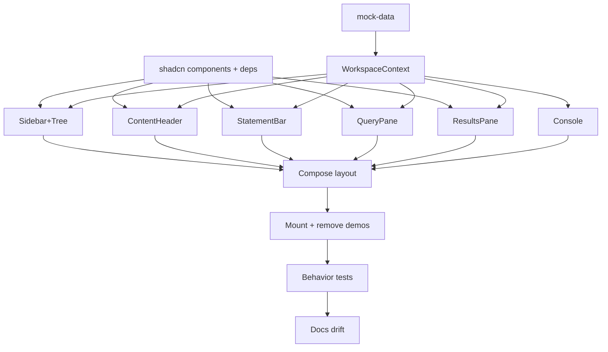

# Plan: Layout - MVP Workspace Shell

**Spec:** docs/features/20260619202258-layout/spec.md
**Created:** 2026-06-19
**Estimated Effort:** ~1-1.5 days
**Status:** Implemented (verified; awaiting user validation before commit)

## 1. Overview

Build the workspace shell with mock data and UI-local state only. Approach: context-driven
compound components - one `WorkspaceProvider` owns all UI state; panels read it via a
`useWorkspace()` hook (no prop drilling). Replace the bootstrap home page; remove demos,
top nav, and command palette. Resizable splits via shadcn `resizable`. Mirrors requi's
layout, reframed from HTTP to SQL (queries, statement kinds, connections, result grids).

Coverage threshold: none.

## 2. Task Breakdown

| # | Task | Spec Ref | Files | Type | Estimate |
|---|------|----------|-------|------|----------|
| 1 | Add shadcn components: resizable, tabs, input, select, scroll-area, badge; add deps radix-ui + react-resizable-panels | deps, AC-013 | `src/components/ui/*`, `package.json` | impl | 0.5h |
| 2 | Mock data module: ADT tree + connection union + result rows/columns + console lines, seeded to approved layout | AC-003, data model | `src/components/workspace/mock-data.ts` | impl | 1h |
| 3 | WorkspaceContext + provider + `useWorkspace` hook (state + actions, immutable updates) | AC-014, behavior notes | `src/components/workspace/workspace-context.tsx` | impl | 1.5h |
| 4 | SidebarTree + recursive TreeRow (folders expand/collapse, query leaf badge, selection) | AC-003, AC-004, AC-005, AC-006 | `src/components/workspace/{sidebar,sidebar-tree,tree-row}.tsx`, `kind-color.ts` | impl | 1.5h |
| 5 | ContentHeader (open-query tabs + close + `+`) | AC-007 | `src/components/workspace/content-header.tsx` | impl | 1h |
| 6 | StatementBar (kind select + target display + inert Run) | AC-008 | `src/components/workspace/statement-bar.tsx` | impl | 0.5h |
| 7 | QueryPane (SQL/Params/Options/Connection/Script tabs; connection union switch) | AC-009, AC-011 | `src/components/workspace/{query-pane,key-value-table,pane-tabs}.tsx` | impl | 1h |
| 8 | ResultsPane (Results grid + Columns tabs + status readout) | AC-010, AC-016 | `src/components/workspace/{results-pane,result-grid}.tsx` | impl | 1h |
| 9 | Console strip (mock log lines) | AC-012 | `src/components/workspace/console.tsx` | impl | 0.5h |
| 10 | Compose Content + Main + WorkspaceLayout (resizable groups) | AC-002, AC-013 | `src/components/workspace/{content,main,workspace-layout}.tsx` | impl | 1h |
| 11 | Mount at home route; remove demos, top nav, command palette | AC-001, AC-015 | `src/routes/{index,__root}.tsx`, `src/app/providers.tsx`, delete demo/palette + bootstrap test | impl | 0.5h |
| 12 | Behavior tests (Vitest + RTL) per TC-002..TC-007 + connection variants | AC-017, TC-002..007 | `src/components/workspace/__tests__/*.test.tsx`, `tests/e2e/bootstrap.spec.tsx` | test | 2h |
| 13 | Docs drift: README repo-layout + commands; learnings/adr | - | `README.md`, `docs/learnings.md`, `docs/adr.md` | impl | 0.5h |

## 3. Execution Order

T2 (mock-data) and T3 (context) are the spine - they unblock every panel. Panels (T4-T9)
parallelize once the context exists.

## 4. TDD Strategy

Per CLAUDE.md TDD: red-green-refactor on behavior. Panels have real interaction (toggle,
select, tab-switch) so they get failing tests first. Pure-presentational bits (Console,
inert Run) get a presence test only.

### RED Phase
- A fresh test-writer subagent writes failing tests for each behavioral panel before the
  implementation exists:
  - TreeRow: expand reveals children / collapse hides; query leaf shows kind badge.
  - Sidebar selection: query leaf click highlights + opens tab; folder click selects, no tab.
  - ContentHeader: tab click focuses; `x` removes; closing active moves active or nulls; no-dup (E-3); null-on-last (E-4); New query control.
  - QueryPane: active sub-tab swaps panel; connection password/token/none render (one per variant); password show/hide toggle.
  - ResultsPane: Results/Columns tab swap; status readout present; grid renders column headers + one row per result row (AC-016); empty grid state (E-7).
  - StatementBar: renders active query kind + target (presence); empty state (E-1).
  - Console: renders each log line.
  - WorkspaceLayout: tree + console render together.
- Tests render a component wrapped in `WorkspaceProvider` seeded with a small fixture tree.

### GREEN Phase
- Implement each panel until its test passes; wire actions through `useWorkspace()`.

### REFACTOR Phase
- Extract shared bits (kind-badge color map, key-value table, pane-tab classes) once duplicated.
- Tighten the context API surface; keep state immutable (Set/array copies, no mutation).

## 5. File Changes

### New Files (under `src/components/workspace/`)
- `mock-data.ts` - ADT tree, connection union, result rows/columns, console lines + seed data
- `workspace-context.tsx` - context, `WorkspaceProvider`, `useWorkspace`
- `kind-color.ts` - statement-kind -> Tailwind color map
- `sidebar.tsx`, `sidebar-tree.tsx`, `tree-row.tsx` - sidebar + recursive tree
- `content-header.tsx`, `statement-bar.tsx` - content top rows
- `query-pane.tsx`, `results-pane.tsx`, `result-grid.tsx` - the two panes + grid
- `key-value-table.tsx`, `pane-tabs.ts` - shared panel bits
- `console.tsx` - console strip
- `content.tsx`, `main.tsx`, `workspace-layout.tsx` - composition + resizable shell
- `__tests__/{fixtures.ts, *.test.tsx}` - behavior tests
- `src/components/ui/{resizable,tabs,input,select,scroll-area,badge}.tsx` - shadcn

### Modified Files
- `src/routes/index.tsx` - render `WorkspaceProvider` + `WorkspaceLayout` instead of demo page
- `src/routes/__root.tsx` - drop top nav + `CommandPalette`; layout owns full window
- `src/app/providers.tsx` - drop `HotkeysProvider` (palette removed); keep QueryClient
- `src/test/setup.ts` - add ResizeObserver stub (radix + resizable need it under jsdom)
- `tests/e2e/bootstrap.spec.tsx` - assert workspace renders, demos/nav/palette gone
- `README.md` - update repo-layout sketch (new `components/workspace/`), drop demo refs
- `docs/learnings.md`, `docs/adr.md` - resizable v4 gotchas; layout architecture decision

### Deleted Files
- `src/components/demo-table.tsx`, `src/components/demo-form.tsx`, `src/components/command-palette.tsx`

## 6. Dependencies

### Must Complete First
- Task 1 (shadcn primitives + deps) blocks panels that use them.
- Tasks 2 + 3 (mock-data, context) block every panel.

### Can Parallelize
- Panels T4-T9 are independent once T1 + T3 land.

## 7. Risks and Mitigations

| Risk | Impact | Mitigation |
|------|--------|------------|
| `react-resizable-panels` v4 renamed `direction` -> `orientation`; shadcn template uses old prop | Typecheck fails / panes mis-size | Use `orientation` at call sites (requi learning) |
| v4 `Panel` size props read bare number as PIXELS | Panel renders a few px wide | Pass `"20%"` strings, not `20` (requi learning) |
| jsdom has no `ResizeObserver`; radix Select/Tabs + resizable need it | Tests crash | ResizeObserver stub in `src/test/setup.ts` (already present from bootstrap; keep) |
| radix `SelectValue` renders nothing until opened (Portal); jsdom can't open | Value assertions fail | Render value as explicit `SelectTrigger` children, not `<SelectValue/>` |
| Removing command-palette strands `Mod+K` + `HotkeysProvider` | Build/lint error | Remove palette, hotkey wiring, and HotkeysProvider together in T11 |
| Result grid reuses TanStack Table; column shape must match rows | Grid renders blank | Drive columns from `result.columns`; rows are `Record<string,string>` keyed by column name |
| Sub-tab state global vs per-query surprises later | Rework when editing lands | Documented MVP decision; revisit when real actions added |

## 8. Acceptance Verification

| AC ID | Criterion | Test(s) | Status |
|-------|-----------|---------|--------|
| AC-001 | Layout at home route | bootstrap.spec "render the workspace at the home route" | Pass |
| AC-002 | Full-window sidebar+content+console | workspace-layout "render the tree and console together" | Pass |
| AC-003 | Tree with 3-deep nesting + kind badge | sidebar-tree "nested three folders deep", "kind badge" | Pass |
| AC-004 | Folder expand/collapse | sidebar-tree "reveal/hide a folder's children" | Pass |
| AC-005 | Query click selects + opens tab | sidebar-tree "select a query and open its tab" | Pass |
| AC-006 | Folder click selects, no tab | sidebar-tree "not open a query tab when a folder is clicked" | Pass |
| AC-007 | Content-header tabs + close + `+` | content-header: active, close, no-dup (E-3), reassign (E-4), null-on-last (E-4), New query | Pass |
| AC-008 | Statement bar kind+target+inert Run | statement-bar "kind and target", "empty state" (E-1) | Pass |
| AC-009 | Query sub-tabs render panels | query-pane "sql/params/options after click" | Pass |
| AC-010 | Results sub-tabs + status | results-pane "status and time", "columns after click" | Pass |
| AC-011 | Connection variants render | query-pane connection password/token/none | Pass |
| AC-012 | Console strip | console "render each log line" | Pass |
| AC-013 | Resizable splits | manual/smoke (handles present; shadcn primitive owns drag) | Manual |
| AC-014 | Shared UI state, no prop drilling | architectural - panels render under provider only | Pass (arch) |
| AC-015 | Demos + nav + palette removed | bootstrap.spec "no bootstrap demo nav"; grep clean | Pass |
| AC-016 | Results grid rows × columns + empty | results-pane "grid headers and rows", "empty grid" (E-7) | Pass |
| AC-017 | lint + typecheck + test pass | typecheck 0, lint 0 err, full suite green, build ok | Pass |
