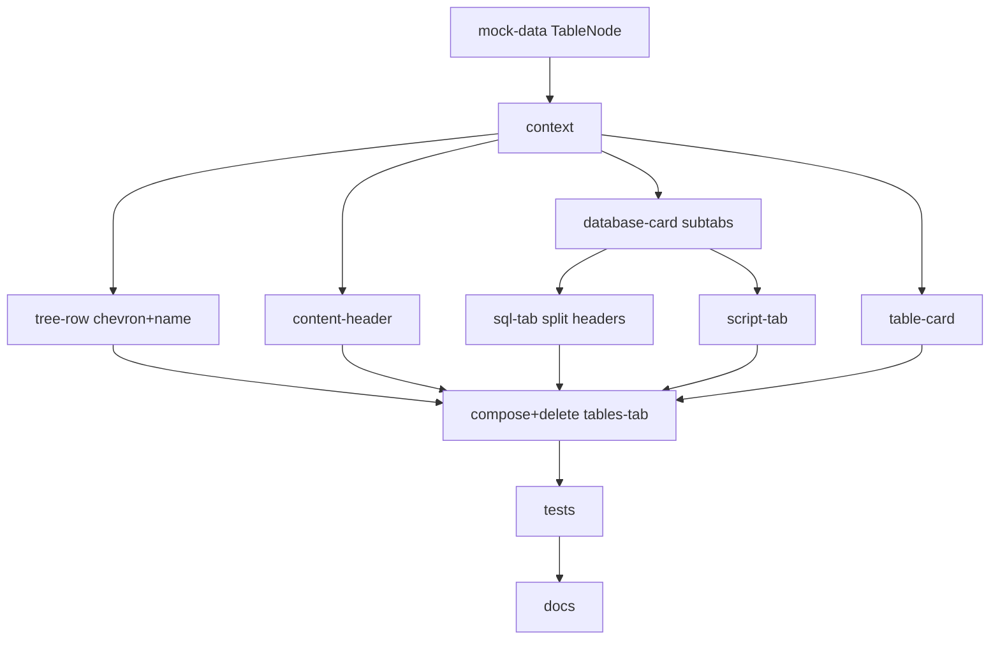

# Plan: Layout - Database Workspace Shell

**Spec:** docs/features/20260619202258-layout/spec.md
**Created:** 2026-06-19
**Status:** Implemented (verified; awaiting user validation before commit)

> Single source of truth for the layout feature. The earlier "workbench" and "table-cards"
> docs were folded back into this folder - they were iterations of this feature.

## 1. Overview

Workspace shell with mock data + UI-local state via one `WorkspaceProvider` context +
compound components; resizable shell. Final state: sidebar folders > databases (expandable)
> tables (leaves); content tabs open database cards (SQL/Views/Script/Connection sub-tabs)
or table cards (filter row + grid).

Coverage threshold: none.

## 2. Iteration history (already merged to main)

- **0.1 MVP shell** (commit `05a0df8`): query-centric - sidebar query leaves, statement bar,
  query/results panes, console, resizable shell. Context architecture established.
- **0.2 database-centric** (commit `49f1a12`): database = sidebar leaf; workbench tabs
  SQL/Tables/Views/Connection; statement bar removed; window-height fix; `DatabaseNode`
  replaces `QueryNode`.

## 3. Current iteration (0.3) - task breakdown

| # | Task | Spec Ref | Files | Type |
|---|------|----------|-------|------|
| 1 | mock-data: add `TableNode` kind (columns/rows); `DatabaseNode` gains `tables: TableNode[]`, `savedScripts: string[]`, `script: string`; seed tables under databases | AC-002, AC-004, data model | `src/components/workspace/mock-data.ts` | impl |
| 2 | context: tree node union gains `table`; index tables too; `openTabIds`/`activeTabId` resolve to database OR table; add database-expand (chevron) distinct from open; keep sub-tab `sql\|views\|script\|connection` | AC-004, AC-005, AC-006, AC-007, AC-018 | `src/components/workspace/workspace-context.tsx` | impl |
| 3 | tree-row: database row = chevron (toggles tables) + name (opens card); render table children when expanded; table leaf row opens a table card | AC-004, AC-005, AC-006 | `src/components/workspace/tree-row.tsx` | impl |
| 4 | content-header: tabs for databases AND tables (label by node name); close/`+`/focus unchanged | AC-007 | `src/components/workspace/content-header.tsx` | impl |
| 5 | database card: rename Workbench->DatabaseCard; sub-tabs SQL/Views/Script/Connection (drop Tables, add Script) | AC-008 | `src/components/workspace/database-card.tsx` (rename workbench.tsx) | impl |
| 6 | sql-tab: split into two columns each with its OWN header - left header (saved-script names + Run) over editor; right header (status readout) over result grid | AC-009, AC-010, AC-011 | `src/components/workspace/sql-tab.tsx` | impl |
| 7 | script-tab: read-only script text + empty state | AC-013 | `src/components/workspace/script-tab.tsx` | impl |
| 8 | table-card: filter input row (text input + column select) + content grid + empty state | AC-015 | `src/components/workspace/table-card.tsx` | impl |
| 9 | content: render database card OR table card by active node kind; delete tables-tab.tsx | AC-008, AC-015, AC-019 | `src/components/workspace/content.tsx`; delete `tables-tab.tsx` | impl |
| 10 | tests: extend fixtures with TableNode + savedScripts + script; rework tree/content-header/card tests; new sql-tab split, script-tab, table-card tests; update tables-tab test (delete) | AC-020, TC-001..008 | `src/components/workspace/__tests__/*`, `tests/e2e/bootstrap.spec.tsx` | test |
| 11 | docs drift: README workspace blurb + repo layout; learnings/adr | - | `README.md`, `docs/learnings.md`, `docs/adr.md` | impl |

## 4. Execution Order

## 5. TDD Strategy

RED-first: a fresh test-writer extends fixtures (TableNode, savedScripts, script) and writes
failing tests for the new contract (chevron-vs-name, table card, split SQL headers, Script
sub-tab, no Tables sub-tab) BEFORE the components change. Then GREEN: restructure until green.
REFACTOR: keep ADT switches over `kind`/`type`; no ifology; state immutable.

### RED (new/retargeted)
- tree-row: chevron toggles tables (no card); name opens card; table leaf opens table card; 2-deep nesting; root db.
- content-header: open db tab + open table tab; close/no-dup/reassign; `+` present.
- database-card: sub-tabs SQL/Views/Script/Connection (NO Tables); panel swap.
- sql-tab: left header has saved-script names + Run; right header has status readout (two separate headers); editor text left, grid right; zero-row empty + status (E-6).
- script-tab: script text + empty (E-7).
- table-card: filter input + column select + content grid; empty grid (E-6).
- layout: tree + a card + console; >=2 separators; no statement bar (negative).
- routing (bootstrap.spec): unchanged - home tree + console, no nav/dialog, settings + 404.

### GREEN / REFACTOR
- Implement per contract; wire via `useWorkspace()`.

## 6. File Changes (iteration 0.3)

### New
- `src/components/workspace/database-card.tsx` (renamed from workbench.tsx)
- `src/components/workspace/script-tab.tsx`
- `src/components/workspace/table-card.tsx`

### Modified
- `mock-data.ts`, `workspace-context.tsx`, `tree-row.tsx`, `content-header.tsx`,
  `sql-tab.tsx`, `content.tsx`
- `__tests__/*`, `tests/e2e/bootstrap.spec.tsx`, `README.md`, `docs/learnings.md`, `docs/adr.md`

### Deleted
- `src/components/workspace/tables-tab.tsx` + `__tests__/tables-tab.test.tsx`

## 7. Risks and Mitigations

| Risk | Impact | Mitigation |
|------|--------|------------|
| Chevron click bubbling to the row (opening the card) | Wrong behavior | `stopPropagation` on the chevron handler; test asserts chevron-only toggles, no card opens |
| Nested resizable inside a tab breaks jsdom tab-switch (known) | Tests crash | Keep editor\|results a fixed flex split (existing learning) |
| Two card kinds (database vs table) by node type | Wrong card renders | Resolve by `activeNode.kind` in content; tests cover mixed open tabs (E-8) |
| Deleting tables-tab strands imports | Build error | Grep `tables-tab`/`TablesTab` after T9 |
| Table card filter is inert but must look functional | Scope creep | Render input + column select read-only; AC-015 asserts presence only |

## 8. Acceptance Verification (iteration 0.3 ACs)

| AC | Criterion | Test | Status |
|----|-----------|------|--------|
| AC-001 | Full window height | index.css chain (0.2); build | Pass |
| AC-002 | Folders + db leaf + root + nesting | tree tests | Pass |
| AC-003 | Folder expand/collapse | tree tests | Pass |
| AC-004 | DB chevron toggles tables, no card | tree "chevron toggles tables" | Pass |
| AC-005 | DB name opens card | tree "name opens card" | Pass |
| AC-006 | Table leaf opens table card | tree/content-header "table card" | Pass |
| AC-007 | Tabs db+table, close/`+`/no-dup/reassign | content-header tests | Pass |
| AC-008 | DB sub-tabs SQL/Views/Script/Connection | database-card tests | Pass |
| AC-009 | SQL left header: scripts + Run | sql-tab "left header" | Pass |
| AC-010 | SQL right header: status readout (separate) | sql-tab "right header" | Pass |
| AC-011 | SQL editor + grid + zero-row empty | sql-tab tests | Pass |
| AC-012 | Views list + empty | database-card views | Pass |
| AC-013 | Script text + empty | script-tab tests | Pass |
| AC-014 | Connection variants | database-card connection | Pass |
| AC-015 | Table card filter row + grid + empty | table-card tests | Pass |
| AC-016 | Console strip | console test | Pass |
| AC-017 | Resizable shell splits | layout "separators" | Pass |
| AC-018 | Shared state, no prop drilling | layout cross-panel | Pass |
| AC-019 | No active tab empty state | content "empty" | Pass |
| AC-020 | lint + typecheck + test 0 | gates | Pass |
