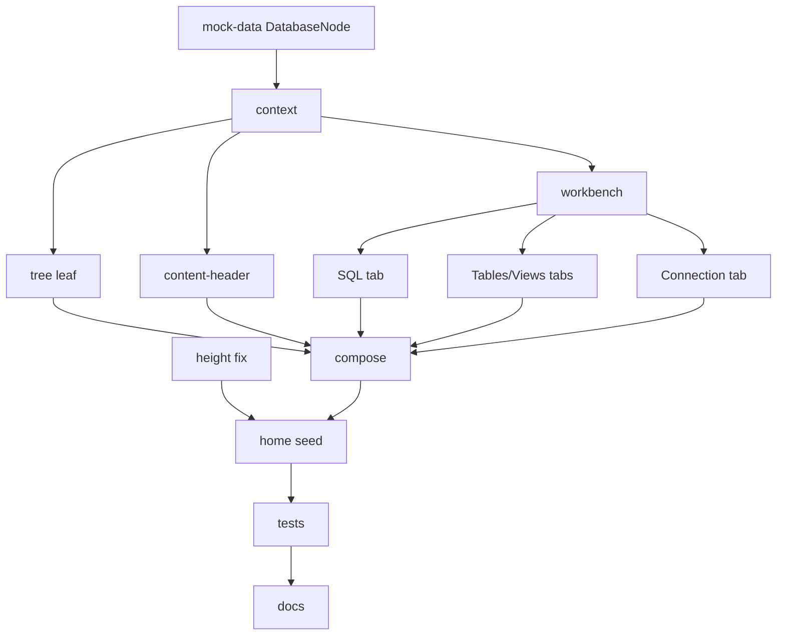

# Plan: Workbench - Database-Centric Layout Rework

**Spec:** docs/features/20260619214347-workbench/spec.md
**Created:** 2026-06-19
**Estimated Effort:** ~0.5 day
**Status:** Implemented (verified; awaiting user validation before commit)
**Reworks:** docs/features/20260619202258-layout

## 1. Overview

Restructure the existing workspace shell from query-centric to database-centric. Keep the
proven `WorkspaceProvider` context + compound-component architecture and the resizable
shell; change the domain (DatabaseNode replaces QueryNode), remove the statement bar, and
turn the two-pane query/results split into a database workbench with SQL / Tables / Views /
Connection tabs. Fix the window-height bug. Mock data only.

Coverage threshold: none.

## 2. Task Breakdown

| # | Task | Spec Ref | Files | Type |
|---|------|----------|-------|------|
| 1 | Fix height chain: `html, body, #root { height: 100% }` | AC-001 | `src/index.css` | impl |
| 2 | Rework mock-data: `DatabaseNode` (connection/tables/views/sql/result), drop `QueryNode`/`StatementKind`; reseed tree with folders + root-level db leaf | AC-002, data model | `src/components/workspace/mock-data.ts` | impl |
| 3 | Rework context: rename query->database (openDatabaseIds, activeDatabaseId, activeDatabase), workbench tab union `sql\|tables\|views\|connection`; drop statement-kind state | AC-006, AC-008, AC-015 | `src/components/workspace/workspace-context.tsx` | impl |
| 4 | Tree: database leaf (db glyph + name, no kind badge); folder rows unchanged | AC-002, AC-003, AC-004, AC-005 | `src/components/workspace/tree-row.tsx`; delete `kind-color.ts` | impl |
| 5 | Content-header: open-database tabs (name only, no kind badge) | AC-006 | `src/components/workspace/content-header.tsx` | impl |
| 6 | Workbench component: Tabs SQL/Tables/Views/Connection; Run lives in SQL tab header | AC-008, AC-009 | `src/components/workspace/workbench.tsx` (replaces query-pane + results-pane + statement-bar) | impl |
| 7 | SQL tab: read-only SQL editor over result grid, resizable split + inert Run + status readout | AC-009, AC-014 | `src/components/workspace/sql-tab.tsx`, reuse `result-grid.tsx` | impl |
| 8 | Tables tab (name/rows/size grid + empty) and Views tab (name list + empty) | AC-010, AC-011 | `src/components/workspace/{tables-tab,views-tab}.tsx` | impl |
| 9 | Connection tab: union none/password/token (reuse password reveal) | AC-012 | `src/components/workspace/connection-tab.tsx` | impl |
| 10 | Compose: Content = ContentHeader + Workbench (no statement bar); Main/WorkspaceLayout unchanged | AC-007, AC-013, AC-014 | `src/components/workspace/content.tsx`; delete `statement-bar.tsx`, `query-pane.tsx`, `results-pane.tsx` | impl |
| 11 | Update home route seed (expanded folder ids + initial active db id) | AC-001 | `src/routes/index.tsx`, `mock-data.ts` exports | impl |
| 12 | Rework tests: fixtures -> DatabaseNode tree; rename/retarget the workspace + routing tests to the new contract | AC-017, TC-001..007 | `src/components/workspace/__tests__/*`, `tests/e2e/bootstrap.spec.tsx` | test |
| 13 | Docs drift: README workspace blurb + repo layout; learnings/adr | - | `README.md`, `docs/learnings.md`, `docs/adr.md` | impl |

## 3. Execution Order

## 4. TDD Strategy

This reworks an existing tested feature. Treat the new contract as RED-first: a fresh
test-writer rewrites the workspace + routing tests against the database-centric contract
(DB leaves, workbench tabs, no statement bar, height) BEFORE the components change. The old
query-centric tests are replaced, not kept. Then GREEN: restructure components until the
new suite passes. REFACTOR: collapse duplication (the SQL/Tables/Views/Connection panels
share the pane-tab classes; password field reused in Connection tab).

### RED (new/retargeted tests)
- tree: database leaf opens a tab; folder click opens none; 2-deep nesting; root-level db.
- content-header: open/focus/close, no-dup (E-3), reassign/null-on-last (E-4), New + button.
- workbench: 4 tabs present; switching renders each panel.
- sql-tab: SQL text + inert Run + result grid + status readout; zero-row grid empty (E-7).
- tables-tab: table rows (name/rows/size) + empty state.
- views-tab: view names + empty state.
- connection-tab: token / password(+reveal) / none variants.
- layout: tree + workbench + console render together; >=3 resizable separators; NO statement-bar group present (AC-007 negative assertion).
- routing (bootstrap.spec): home renders tree + console; no old nav/dialog; settings + 404 still work.

### GREEN
- Implement per the contract; wire actions through `useWorkspace()`.

### REFACTOR
- Keep ADT switches (connection `type`, tree `kind`); no ifology. State immutable.

## 5. File Changes

### New
- `src/components/workspace/workbench.tsx` - tab shell (SQL/Tables/Views/Connection)
- `src/components/workspace/sql-tab.tsx` - SQL editor + Run + result grid (resizable)
- `src/components/workspace/tables-tab.tsx`, `views-tab.tsx`, `connection-tab.tsx`

### Modified
- `src/index.css` - height chain
- `src/components/workspace/mock-data.ts` - DatabaseNode model + seed
- `src/components/workspace/workspace-context.tsx` - database-centric state + workbench tab union
- `src/components/workspace/tree-row.tsx` - database leaf (no kind badge)
- `src/components/workspace/content-header.tsx` - db tabs (name only)
- `src/components/workspace/content.tsx` - drop statement bar; render Workbench
- `src/routes/index.tsx` - seed ids
- `src/components/workspace/__tests__/*`, `tests/e2e/bootstrap.spec.tsx` - new contract
- `README.md`, `docs/learnings.md`, `docs/adr.md`

### Deleted
- `src/components/workspace/{statement-bar,query-pane,results-pane,kind-color}.tsx` and
  their tests (`statement-bar.test.tsx`, `query-pane.test.tsx`, `results-pane.test.tsx`)

## 6. Dependencies

### Must Complete First
- T2 (mock-data) + T3 (context) are the spine - unblock every panel.

### Can Parallelize
- T7/T8/T9 (workbench tab panels) once T6 lands.

## 7. Risks and Mitigations

| Risk | Impact | Mitigation |
|------|--------|------------|
| Height fix alone insufficient if a parent div lacks `h-full` | Still collapses | `WorkspaceLayout` already uses `h-full w-full`; verify the chain from `#root` down compiles + renders full-height |
| Deleting query-pane/results-pane strands imports | Build error | Grep for `query-pane`/`results-pane`/`statement-bar`/`StatementKind`/`kind-color` after T10; remove together |
| Result grid reused from layout; result shape unchanged | Low | `QueryResult` carried over verbatim onto `DatabaseNode.result` |
| Resizable nesting (SQL editor\|results inside a tab inside panes) | Mis-size | Use `orientation`/`"%"` sizes (existing learnings); test separator count |
| Tests are a near-total rewrite of the layout suite | Churn | Fresh test-writer authors the new contract; old query-centric tests deleted, not patched |

## 8. Acceptance Verification

| AC | Criterion | Test | Status |
|----|-----------|------|--------|
| AC-001 | Full window height | index.css height chain; build; layout render | Pass |
| AC-002 | DB leaves + folder grouping + root leaf + nesting | tree "render db leaves", "2-deep", "root-level db" | Pass |
| AC-003 | Folder expand/collapse | tree "reveal/hide children" | Pass |
| AC-004 | DB click selects + opens tab | tree "select db and open its tab" | Pass |
| AC-005 | Folder click opens no tab | tree "no tab when folder clicked" | Pass |
| AC-006 | DB tabs + close + `+` | content-header active/close/no-dup/reassign/null-on-last/New | Pass |
| AC-007 | Statement bar removed | layout "no statement-bar group" (negative) | Pass |
| AC-008 | Workbench SQL/Tables/Views/Connection | workbench "four tabs + panel swap" | Pass |
| AC-009 | SQL tab text + Run + grid + status | sql-tab "sql/run/grid/status", "zero-row empty" | Pass |
| AC-010 | Tables grid | tables-tab "rows name/rows/size", "empty" | Pass |
| AC-011 | Views list | views-tab "names", "empty" | Pass |
| AC-012 | Connection variants | connection-tab token/password/none | Pass |
| AC-013 | Console strip | console "render each log line" | Pass |
| AC-014 | Resizable splits | layout "separators"; sql-tab editor/results split | Pass |
| AC-015 | Shared state, no prop drilling | layout "tree selection drives workbench" (arch) | Pass |
| AC-016 | No-active-database empty state | workbench "empty when no active database" | Pass |
| AC-017 | lint + typecheck + test 0 | gates | Pass |
